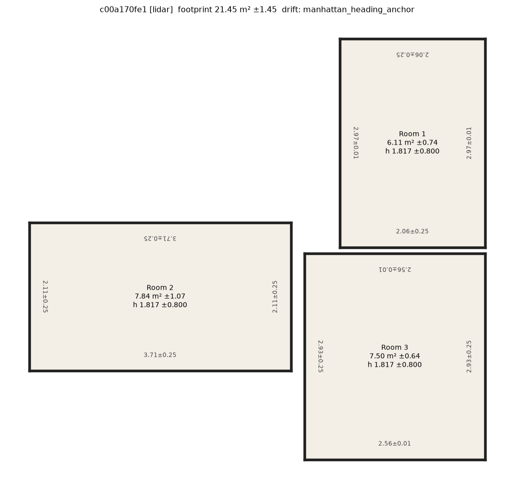
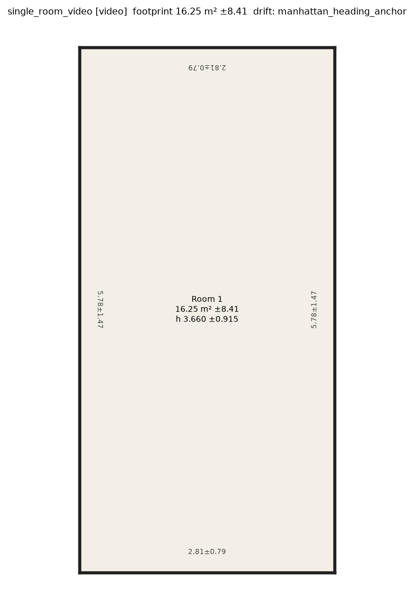
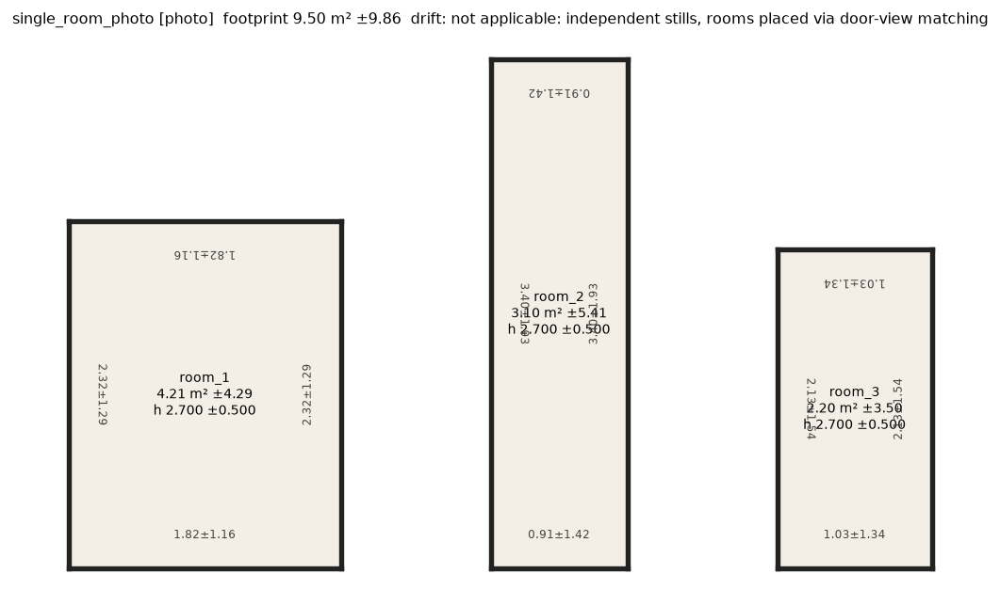
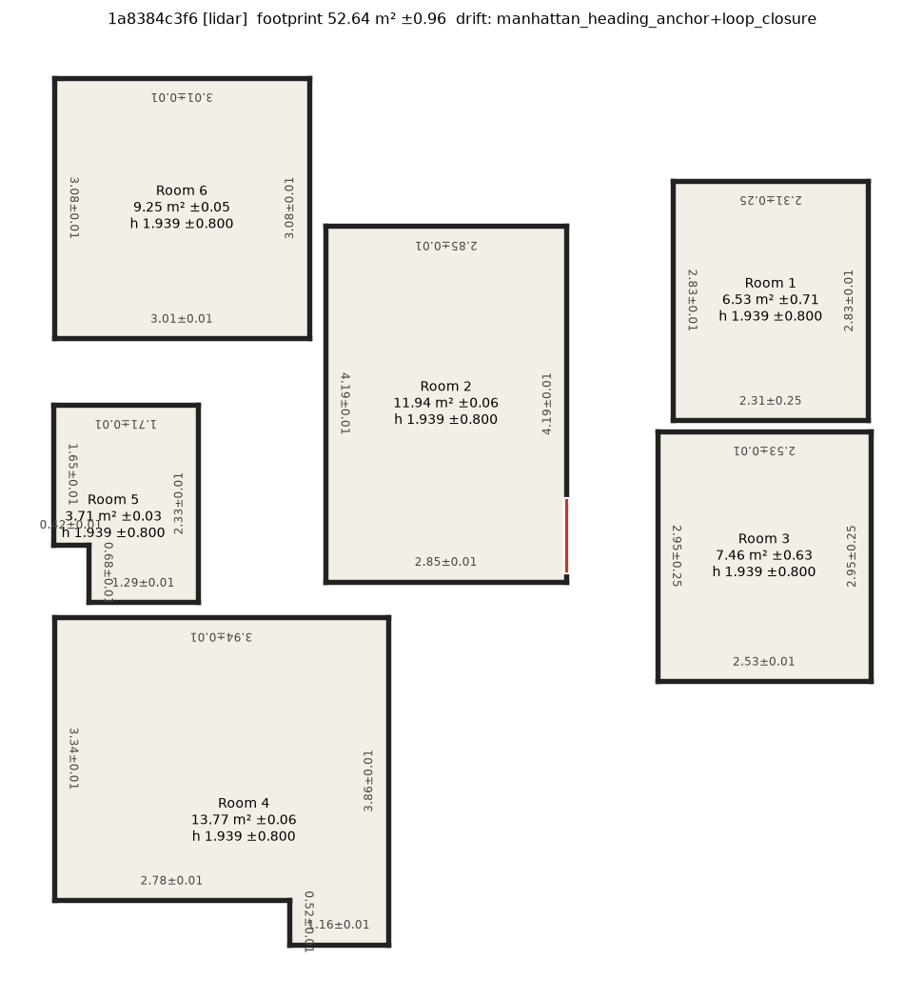
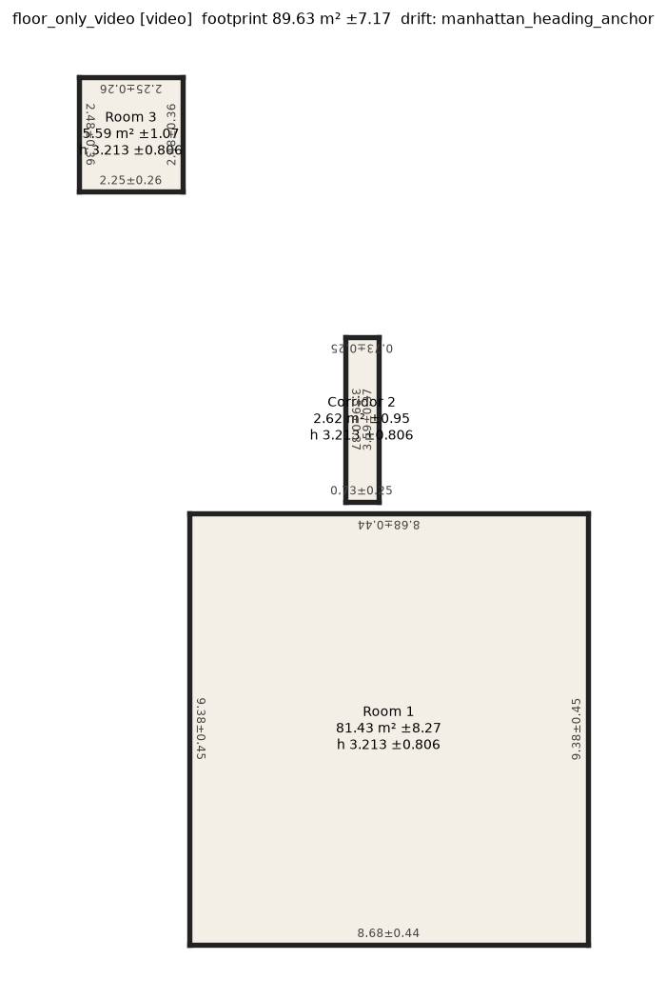
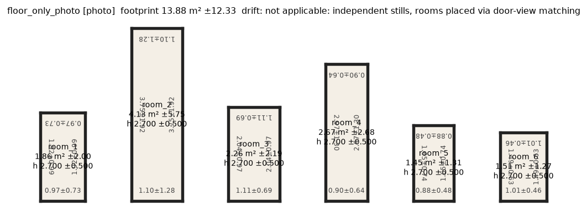
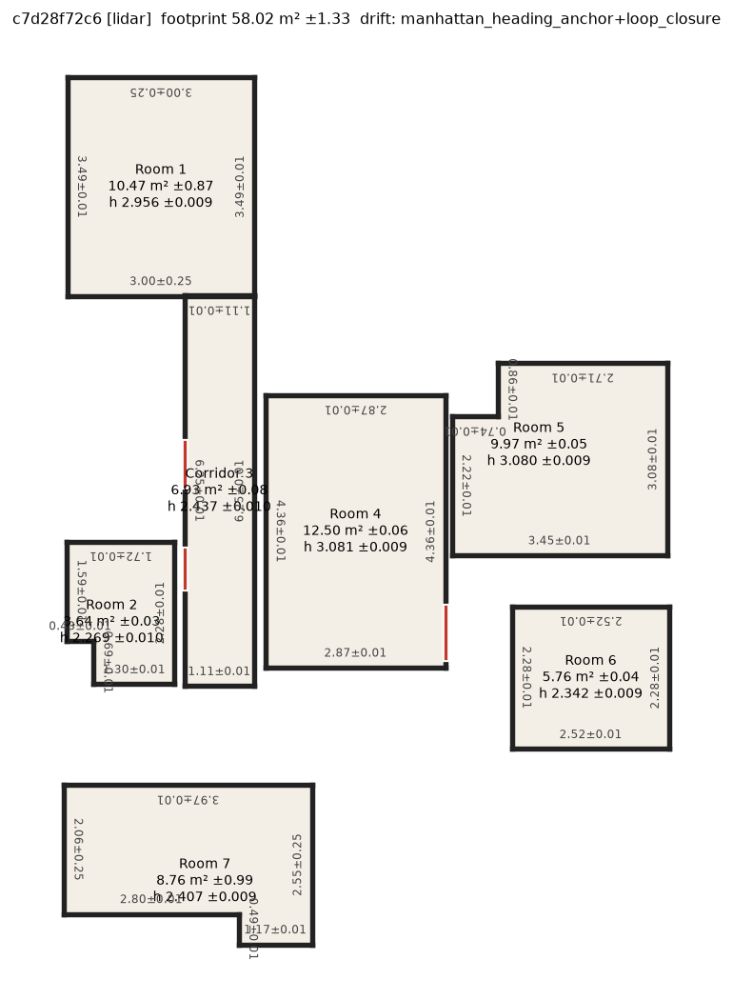
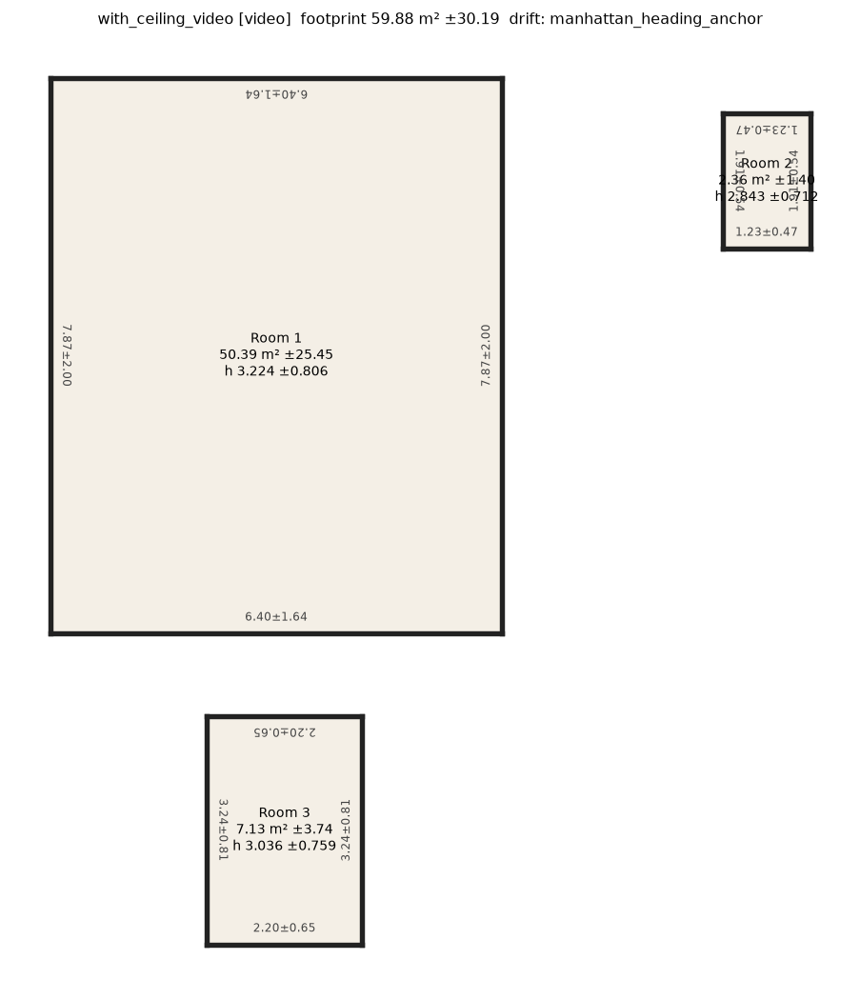
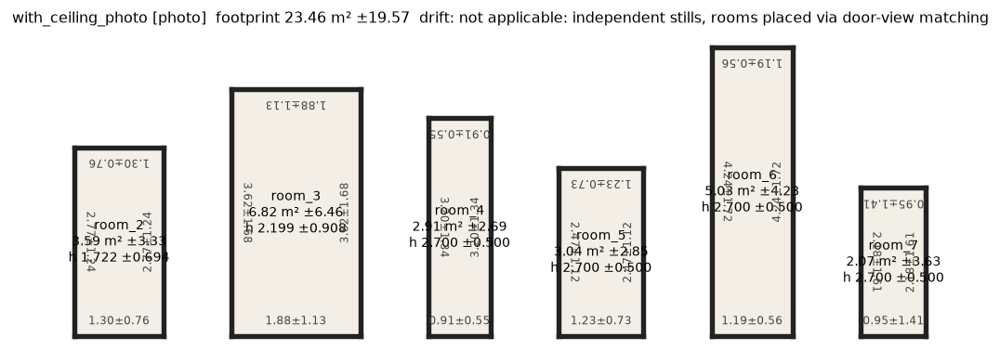

# Benchmark results (regenerated by scripts/run_all.sh)

Reference = LiDAR tier on the same capture (no tape ground truth for the sample data).

## Per tier

| capture | tier | rooms | adjacencies | doors | windows | footprint m² [90% CI] | median wall ±m | ceilings m | damage / flags / scope | runtime s |
|---|---|---|---|---|---|---|---|---|---|---|
| single_room | lidar | 3 | 0 | 0 | 0 | 21.45 [20.00, 22.90] | 0.250 | 1.82, 1.82, 1.82 (ceiling not observed) | 2 / 2 / 4 | 172.57 |
| single_room | video | 1 | 0 | 0 | 0 | 16.25 [7.84, 24.65] | 1.466 | 3.66 | 0 / 0 / 0 | 250.44 |
| single_room | photo | 3 | 0 | 0 | 0 | 9.50 [0.00, 19.36] | 1.294 | 2.70, 2.70, 2.70 (ceiling not visible in any photo) | 0 / 0 / 0 | 4.02 |
| floor_only | lidar | 6 | 1 | 1 | 0 | 52.64 [51.69, 53.60] | 0.012 | 1.94, 1.94, 1.94, 1.94, 1.94, 1.94 (ceiling not observed) | 0 / 0 / 0 | 173.74 |
| floor_only | video | 3 | 0 | 0 | 0 | 89.63 [82.47, 96.80] | 0.370 | 3.21, 3.21, 3.21 (ceiling not observed) | 1 / 0 / 1 | 856.7 |
| floor_only | photo | 6 | 0 | 0 | 0 | 13.88 [1.55, 26.20] | 0.738 | 2.70, 2.70, 2.70, 2.70, 2.70, 2.70 (ceiling not visible in any photo) | 0 / 0 / 0 | 42.33 |
| with_ceiling | lidar | 7 | 2 | 3 | 0 | 58.02 [56.69, 59.35] | 0.012 | 2.96, 2.27, 2.44, 3.08, 3.08, 2.34, 2.41 | 0 / 0 / 0 | 183.74 |
| with_ceiling | video | 3 | 0 | 0 | 0 | 59.88 [29.69, 90.07] | 0.810 | 3.22, 2.84, 3.04 | 0 / 0 / 0 | 767.87 |
| with_ceiling | photo | 6 | 0 | 0 | 0 | 23.46 [3.88, 43.03] | 1.182 | 1.72, 2.20, 2.70, 2.70, 2.70, 2.70 (ceiling not visible in any photo) | 0 / 0 / 0 | 10.71 |

## Cross-tier footprint vs LiDAR reference

| capture | tier | footprint | LiDAR | error % | LiDAR value inside tier's interval? |
|---|---|---|---|---|---|
| single_room | video | 16.25 [7.84, 24.65] | 21.45 | -24.3 | yes |
| single_room | photo | 9.50 [0.00, 19.36] | 21.45 | -55.7 | NO |
| floor_only | video | 89.63 [82.47, 96.80] | 52.64 | +70.3 | NO |
| floor_only | photo | 13.88 [1.55, 26.20] | 52.64 | -73.6 | NO |
| with_ceiling | video | 59.88 [29.69, 90.07] | 58.02 | +3.2 | yes |
| with_ceiling | photo | 23.46 [3.88, 43.03] | 58.02 | -59.6 | NO |

## Drift ablation (LiDAR tier, stitched footprint)

| capture | correction on | correction off | heading corrected (max deg) | loop closure |
|---|---|---|---|---|
| single_room | 21.45 [20.00, 22.90] (3 rooms) | 22.11 [20.85, 23.36] (3 rooms) | 1.57 | walk did not end near its start |
| floor_only | 52.64 [51.69, 53.60] (6 rooms) | 52.58 [51.53, 53.63] (6 rooms) | 5.003 | closed, offset [-0.1752, -0.0061, -0.0793] m over 53.95 m |
| with_ceiling | 58.02 [56.69, 59.35] (7 rooms) | 53.68 [52.53, 54.84] (7 rooms) | 1.874 | closed, offset [0.1919, 0.0, -0.0823] m over 98.87 m |

## Fix loop: damage detector before / after (LiDAR tier)

| capture | before: regions (classes on floor) | after: regions | after: flags / scope |
|---|---|---|---|
| single_room | 10 (2 impossible) | 2 | 2 / 4 |
| floor_only | 9 (2 impossible) | 0 | 0 / 0 |
| with_ceiling | 14 (3 impossible) | 0 | 0 / 0 |

## Rendered plans

| capture | LiDAR | video | photo |
|---|---|---|---|
| single_room |  |  |  |
| floor_only |  |  |  |
| with_ceiling |  |  |  |
